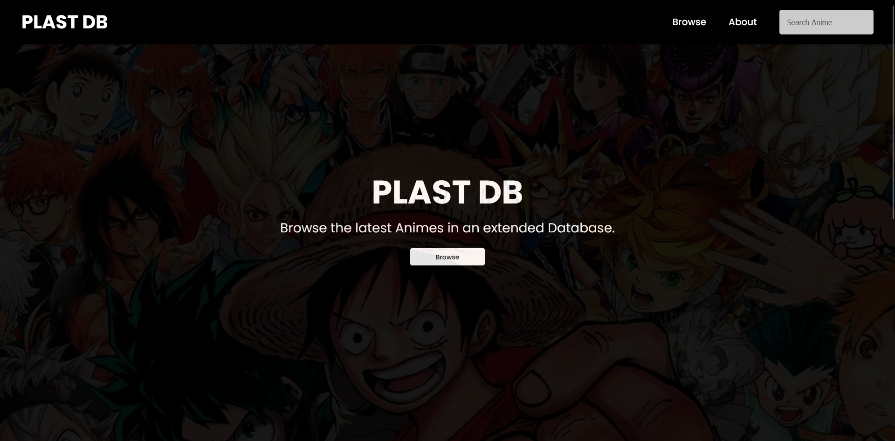

# PLAST DB

This is a remake of my first ever Angular Project [Plast-Manga-DB](https://github.com/tutkli/Plast-Manga-DB).
Browse the current most popular anime with a simple interface.

This project was generated with [Angular CLI](https://github.com/angular/angular-cli) version 15.1.1.

### **Check project at https://tutkli.github.io/plast-db/**

  

## Dependencies

- [Jikan-ts](https://github.com/tutkli/jikan-ts) Node.js wrapper of the Jikan API with built-in typings.
- [TailwindCSS](https://github.com/tailwindlabs/tailwindcss) A utility-first CSS framework for rapid UI development.

## Available Scripts

### `start`

Runs the app in development mode.
Open http://localhost:4200 to view it in the browser.

### `eslint:lint`

Lints the entire project with ESLint and Prettier configuration.

### `analyze-bundle`

Analyzes the bundle size of the project with `webpack-bundle-analyzer`.

## Important Notes

The Jikan API is limited to 3 request per second and 60 per minute. If you don't see any data, wait a little and refresh the page.
